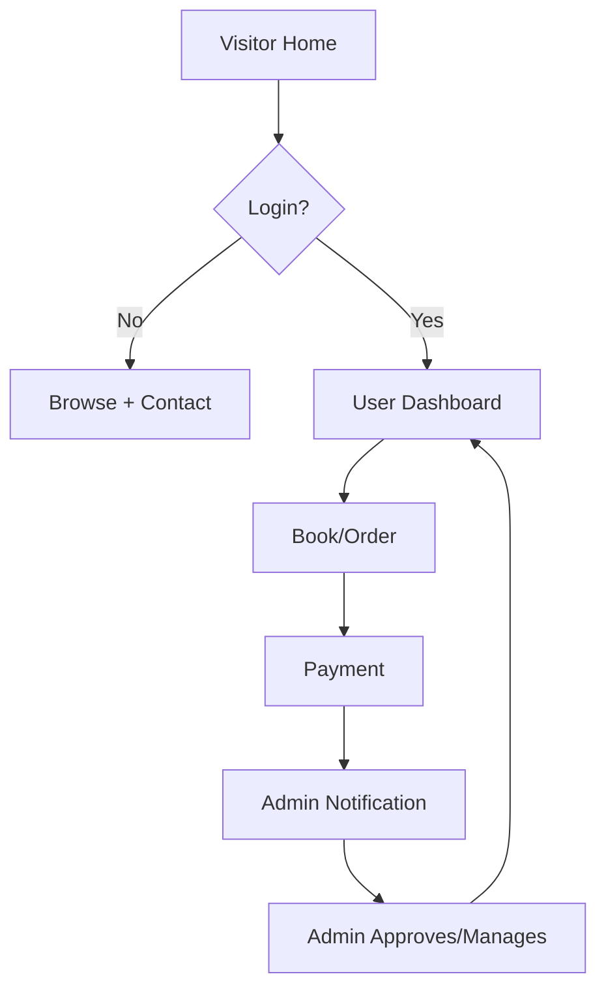
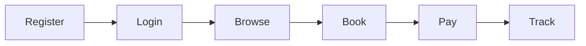
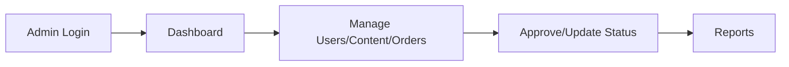

# PROJECT_DOC Template

Copy this structure into `./PROJECT_DOC.md`. Fill with real content, no lorem ipsum.

```markdown
# {Project Name} - Project Documentation

> One-liner: {what + for whom}
> Stack: {backend + frontend + DB}
> Status: Blueprint / In Progress

## 1. Overview
- Problem:
- Solution:
- Target users:
- Goals (3):

## 2. Tech Stack
| Layer | Choice | Why |
|---|---|---|
| ... | ... | ... |

Folder structure:
```
app/
routes/
resources/views/
...
```

## 3. Sitemap / Pages
- Public: /, /about, /services, /contact, /login, /register
- User (auth): /dashboard, /profile, /bookings, ...
- Admin: /admin, /admin/users, /admin/content, /admin/orders, /admin/reports, /admin/settings

## 4. System Flowchart


## 5. User Flow (how user manages it)
1. Register/Login (OTP/Email)
2. Browse services/products
3. Book/Order/Add to cart
4. Pay / Track status
5. Profile, history, support



## 6. Admin Flow (how admin manages it)
1. Login /admin (role: super-admin, staff)
2. Dashboard: stats, new orders/users
3. Manage: users, content/pages, products/services, orders/bookings, payments, reviews
4. Reports: export Excel/PDF
5. Settings: SEO, banners, charges



Permissions table:
| Role | Can |
|---|---|
| super-admin | all |
| staff/editor | content + orders, no settings |
| user | own bookings only |

## 7. Database (core tables)
- users(id, name, email, phone, role, password)
- pages(id, slug, title, body)
- products_services(id, title, price, image, status)
- orders_bookings(id, user_id, item_id, status, payment_status, created_at)
- payments(id, order_id, razorpay_id, amount, status)
- settings(key, value)

## 8. Routes / API
- GET /, /about, /services, /contact
- GET/POST /login, /register, /logout
- Middleware auth: /dashboard, /bookings
- Prefix admin + middleware role:admin: /admin/*

## 9. Build Milestones
- M1: Setup + Auth + Roles
- M2: Public pages + Stitch UI
- M3: User dashboard + booking/order
- M4: Admin panel + reports
- M5: Payment + testing + deploy
```
