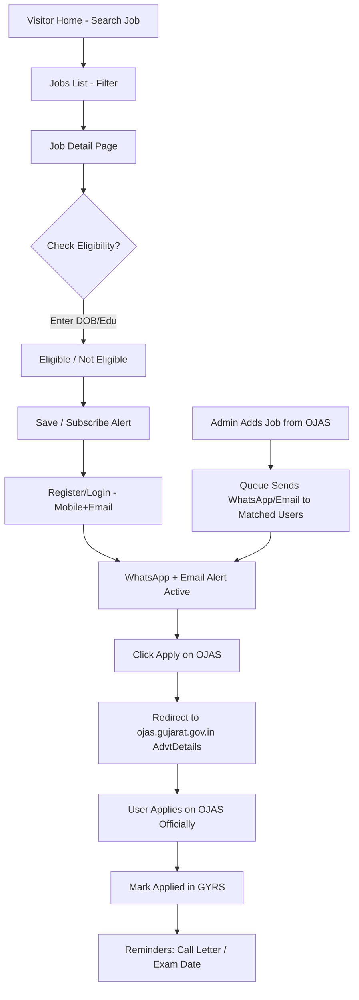
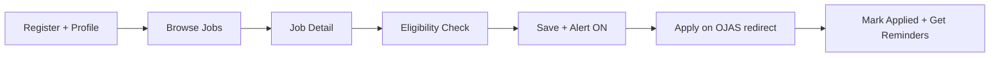
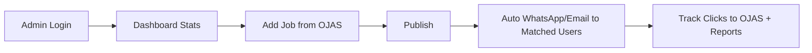

# GYRS - Gujarat Yuva Registration System - Project Documentation (PRD + Blueprint)

> One-liner: Naukri-style modern portal for all Gujarat Govt exams, alerts via WhatsApp/Email, Apply redirects to OJAS.
> Stack: Laravel 11 + Blade + Livewire + Tailwind CSS + MySQL 8
> Reference: https://ojas.gujarat.gov.in/ + https://www.naukri.com/
> Theme: Light only
> Status: Blueprint

## 1. Overview

### Problem
OJAS website (ojas.gujarat.gov.in) is official but old UI, hard to search, no saved profile, no smart alerts, no mobile-friendly job discovery like Naukri. Youth miss last dates.

### Solution - GYRS
GYRS is a light, fast, Naukri-like layer over OJAS:
- All Gujarat govt exams in one searchable place (GPSC, GSSSB, GSRTC, Police, Panchayat, etc.)
- Job detail page in simple Gujarati + English with eligibility, fees, dates, syllabus, PDF
- One-time GYRS profile (education, caste, age, district) → eligibility check + WhatsApp + Email alerts
- Apply button always goes to official OJAS AdvtDetails/Apply page (GYRS does NOT take application, only redirects + tracks "Interested/Applied")

### Target users
- Aspirants 18-35, mobile-first, Gujarati/English
- Admin/content team who copy OJAS ads into GYRS daily

### Goals
1. Never miss a Sarkari exam - alerts before last date
2. Check eligibility in 30 seconds
3. 1-click redirect to OJAS to apply officially

## 2. Tech Stack (Laravel - Fixed)

| Layer | Choice | Version / Note |
|---|---|---|
| Backend | Laravel | 11, PHP 8.2 |
| Frontend | Blade + Livewire 3 + Tailwind CSS | 3.4, light theme only, Alpine.js for dropdowns |
| DB | MySQL | 8.0 |
| Auth | Laravel Breeze (Blade) + spatie/laravel-permission | roles: super-admin, staff, user |
| Queue / Alerts | Laravel Queues + Scheduler + Supervisor | for WhatsApp/Email alerts |
| WhatsApp | Interakt / Gupshup / WATI API (provider configurable) | template msgs: new job, last-date reminder |
| Email | SMTP (Brevo/SES) + Laravel Mail + Mailable | |
| Storage | Laravel public disk + S3 compatible (PDFs, syllabus) | link OJAS PDFs, do not re-host unless allowed |
| Scraping/Manual | Manual entry first, optional OJAS sync later | no auto-apply |
| Deploy | Hetzner / Hostinger VPS + Nginx + MySQL + Redis + Cloudflare + SSL | Redis for cache/queue |

Why Laravel Blade (not SPA): SEO for `gpsc bharti 2026`, `gsrtc helper` searches, cheap shared/VPS hosting, easy admin for non-tech staff, fast Livewire filters like Naukri.

Folder structure:
```
app/Models/ (User, Job, Department, Category, ApplicationTrack, AlertLog, Page, Faq)
app/Livewire/ (JobSearch, EligibilityChecker, AlertSubscribe)
app/Jobs/ (SendWhatsappAlert, SendEmailAlert, LastDateReminder)
routes/web.php (/, /jobs, /job/{slug}, /dashboard, /admin/*)
resources/views/ (layouts/app, home, jobs/index, jobs/show, auth, dashboard, admin)
database/migrations/
```

## 3. Sitemap / Pages

Public (no login):
- `/` Home - hero search, latest jobs, last-date urgent, departments, how it works, FAQ
- `/jobs` All exams - filters: department, qualification, last-date, location, search (Livewire like Naukri)
- `/job/{slug}` Job detail - e.g. `/job/gsrtc-helper-2026` - full details + eligibility check + Apply on OJAS button
- `/departments`, `/results`, `/call-letters`, `/syllabus`, `/about`, `/contact`, `/faq`, `/disclaimer`
- `/login`, `/register`, `/forgot-password` (phone + email)

User (auth `auth`):
- `/dashboard` Overview - saved jobs, applied, alerts status
- `/dashboard/profile` One-time profile - name, mobile, email, DOB, gender, category, education, district, WhatsApp opt-in
- `/dashboard/saved`, `/dashboard/applied`, `/dashboard/alerts` (WhatsApp on/off, Email on/off, preferences)
- `/dashboard/documents` checklist reminder (photo/signature/caste cert as per OJAS upload rules)

Admin (`role:admin`, prefix `/admin`):
- `/admin` Dashboard - total users, jobs live/closing, clicks to OJAS, alerts sent
- `/admin/jobs` CRUD - title, dept, advt no, posts, qualification, age limit, fees, dates, vacancy, syllabus, OJAS apply URL, OJAS PDF URL, status
- `/admin/users`, `/admin/alerts` (queue log, resend), `/admin/pages` (About/FAQ/Disclaimer), `/admin/departments`, `/admin/reports` (applied clicks, WhatsApp delivery), `/admin/settings` (WhatsApp API key, SMTP, site SEO)

## 4. System Flowchart



## 5. User Flow (how user manages it)

1. Register with mobile + OTP + email, fill profile once (education, DOB, category)
2. Browse/Search jobs like Naukri - filter by 10th/12th/Graduate, department
3. Open job detail - read eligibility, fees, age, dates in Gujarati+English
4. Click "Check My Eligibility" - instant yes/no with reason
5. Click "Notify Me on WhatsApp" + "Email Alert" toggle
6. Click "Apply on OJAS" → goes to ojas.gujarat.gov.in official page → apply there → come back & mark Applied
7. Dashboard tracks Saved / Applied / Last-date countdown, gets Call Letter alert



Eligibility logic (v1 simple):
- age = exam_last_date - DOB, check min/max
- education contains required (10th/12th/ITI/Graduate)
- category fees mapping, PH/Ex-serviceman relaxation note

## 6. Admin Flow (how admin manages it)

1. Admin login `/admin` (super-admin creates staff/editor)
2. Dashboard sees: new OJAS ads to add, closing in 3 days, alert queue failures
3. Jobs > Add New: copy from OJAS AdvtList - title GU+EN, dept (GSRTC/GSSSB/GPSC), advt no `GSRTC/202627`, posts, qualification, age, fees General/OBC/SC/ST, start/last date, OJAS apply link, OJAS PDF link, publish
4. On publish → auto queue: find matched users (education/dept pref) → send WhatsApp template + Email
5. Manage Users: verify, block, export Excel
6. Alerts log: who got WhatsApp/Email, delivery, resend failed
7. Content: update Home banner, Results/Call Letter links (all redirect to OJAS PrintApplForm pages), FAQ
8. Reports: most clicked jobs, applied count, alert opt-in %, export
9. Settings: WhatsApp provider key, SMTP, site name GYRS, SEO meta, maintenance



Permissions:
| Role | Can |
|---|---|
| super-admin | all + settings + staff |
| staff/editor | jobs + pages + call-letters, no settings/users delete |
| user | own profile/saved/applied/alerts only |

Important rule to show in UI footer: "GYRS is an alert/help portal. Final application, fees, call letter only on official ojas.gujarat.gov.in"

## 7. Database (core tables - Laravel migrations)

- users(id, name, mobile unique, email unique, password, dob, gender, category[GEN/OBC/SC/ST/EWS], education, district, whatsapp_optin bool, email_optin bool, role)
- departments(id, name_en, name_gu, slug, logo)
- jobs(id, slug unique, title_en, title_gu, department_id, advt_no, total_posts, qualification, age_min, age_max, fees_gen, fees_obc, fees_scst, start_date, last_date, exam_date nullable, ojas_apply_url text, ojas_pdf_url text, syllabus text, how_to_apply text, status[draft/published/closed], views, clicks_to_ojas)
- saved_jobs(id, user_id, job_id)
- application_tracks(id, user_id, job_id, status[saved/interested/applied_on_ojas], clicked_at)
- alert_logs(id, user_id, job_id, channel[whatsapp/email], template, status[sent/failed], provider_msg_id, sent_at)
- pages(id, slug, title_en, title_gu, body)
- settings(key, value)

Indexes: jobs(status, last_date), jobs(slug), users(mobile), alert_logs(job_id, channel)

## 8. Routes / API (web.php)

- GET `/`, `/jobs` (Livewire search), `/job/{slug}`, `/departments`, `/results`, `/syllabus`, `/faq`
- GET/POST `/login`, `/register`, `/forgot-password`, `/logout` (Breeze)
- Middleware `auth`: `/dashboard`, `/dashboard/profile`, `/dashboard/saved`, `/dashboard/alerts`, POST `/job/{id}/save`, `/job/{id}/mark-applied`, `/alerts/toggle`
- Middleware `auth,role:admin` prefix `admin`: resource `jobs, departments, users, pages`, GET `/reports`, `/alerts-log`, `/settings`
- Cron daily 8am: `jobs:send-last-date-reminders` (closing in 3/1 days) → WhatsApp+Email queue

No public API v1, keep web only. Later add `/api/jobs` if mobile app needed.

## 9. Build Milestones (Laravel order)

- M1: Laravel 11 + Breeze + Tailwind light theme + roles + MySQL + deploy staging (2-3 days)
- M2: Departments + Jobs CRUD admin + public Home/Jobs/Detail UI from Stitch (3-4 days)
- M3: Auth + Profile + Saved + Eligibility checker Livewire + Apply-to-OJAS redirect + clicks tracking (3 days)
- M4: WhatsApp (Interakt/Gupshup) + Email queues + Scheduler + Alert logs + toggles (3-4 days)
- M5: Results/Call Letter pages, SEO slugs Gujarati+English, sitemap.xml, Reports Excel, testing + production + Cloudflare (3 days)

Non-goals v1: online form fill inside GYRS, fees collection, dummy apply - all apply strictly on OJAS.
